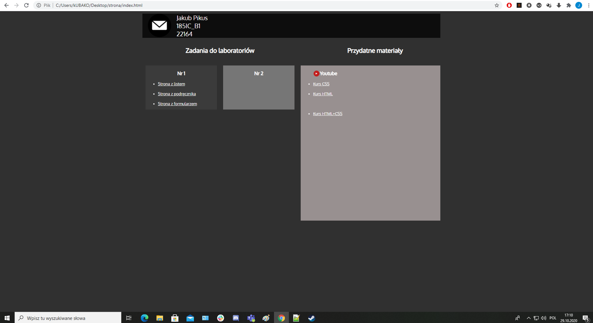
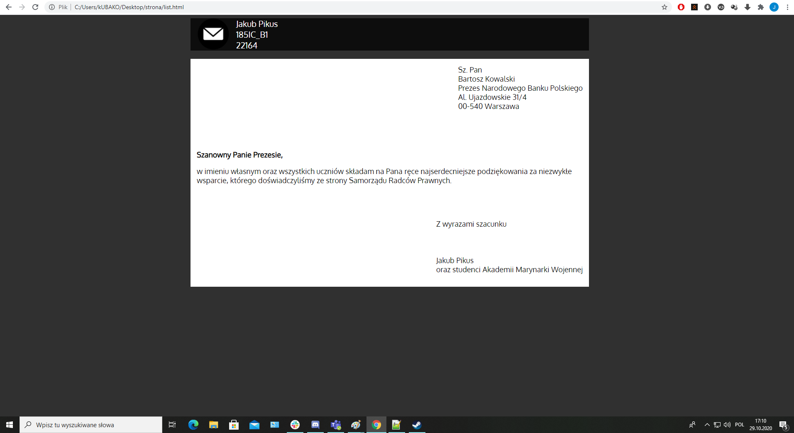
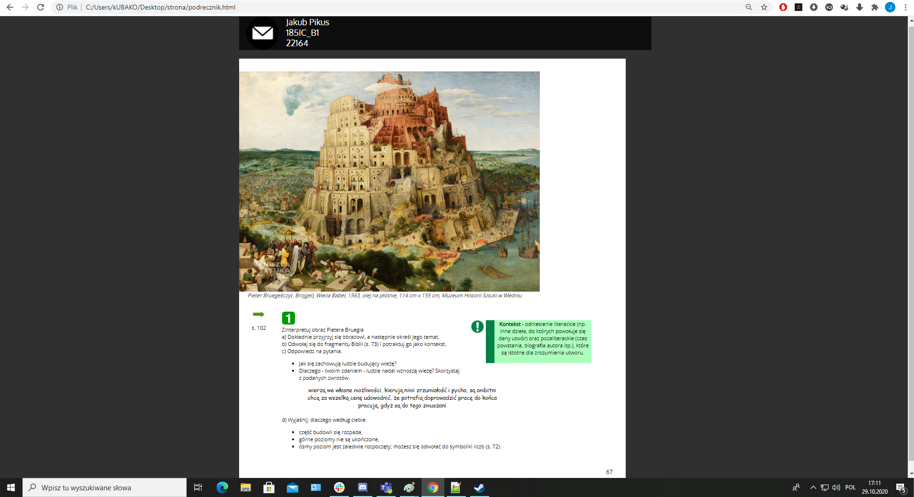
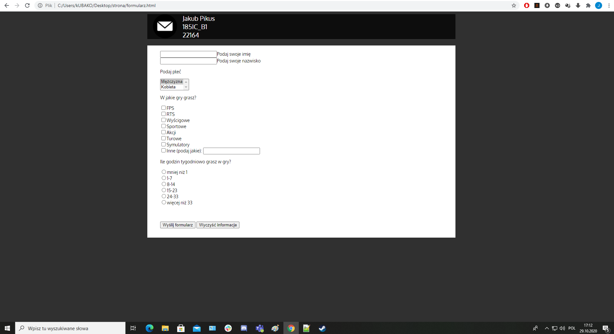

# Lab1

<h3>Jakub Pikus</h3>
<h3>185IC_B1</h3>
<h3>22164</h3>

Plik index.html zawiera stronę główną z odnośnikami do przekierowania na konkretną podstronę 
używa on pliku style.css, do poprawnego wyświetlania wszystkich obiektów

Plik list.html to podstrona z listem 
używa on list.css, do poprawnego wyświetlania wszystkich obiektów

Plik podrecznik.html to podstrona z podręcznikiem 
używa on pliku podrecznik.css

Plik formularz.html to podstrona z formularzem 
używa on pliku podrecznik.css

Wszystkie zdjęcia, które pojawiają się na stronie znajdują się w folderze "img" 
zdjęcia użyte do zaprezentowania działania stron znajdują się w folderze "zrzuty"

# index.html

Na stronie głównej mamy podzieloną sekcję na konkretne zadanie laboratoryjne, jak i pomocne materiały do ich realizacji. 
Można również szybko napisać mail'a do autora strony przez kliknięcie koperty w górnym, lewym rogu stronu.

# list.html

Strona z przykładowym listem do prezesa Narodowego Banku Polskiego.

# podrecznik.html

Strona z przykładową stroną z podręcznika od języka polskiego.

# formularz.html

Strona z przykładowym formularzem o tematyce gier.

