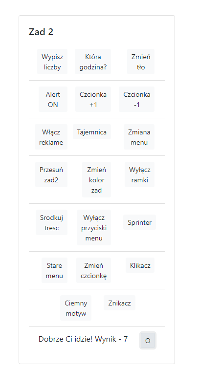

# Lab2

<h3>Jakub Pikus</h3>
<h3>185IC_B1</h3>
<h3>22164</h3>

Plik index.html zawiera nową stronę, opartą na bootstrapie

Wszystkie zadania zostały umieszczone w karcie "Lab2"

Zdjęcia, które pojawiają się na stronie znajdują się w folderze "scr" 
zdjęcia użyte do zaprezentowania działania stron znajdują się w folderze "zrzuty" 
pliki związane z poprzednimi laboratoriami umieszczone zostały w folderze "stare"

# index.html

Na stronie głównej mamy podzieloną sekcję na konkretne zadanie laboratoryjne. Zadania z pierwszych zajęć laboratoryjnych pozostały w niezmiennej formie w odpowiedniej karcie. Wszystkie skrypty zauważalne są, po wciśnięciu odpowiedniego buttona w wyznaczonej sekcji na stronie.

# Wypisz liczby

Następuje chronologiczne wypisanie liczb, które znajdują się w zbiorze pomiędzy tymi podanymi

# Która godzina?

Wyświetla aktualną godzinę.

# Zmiana tła

Strona z przykładowym formularzem o tematyce gier.

# Komunikat

Po wciśnięciu odpowiedniego buttona, następuje wyświetlenie komunikatu.

# +1/-1 czcionka

Zwiększa/pomniejsza czcionke. Navbar i buttony pozostają bez zmian.

# Reklama

Wyświetla reklame na stronie.

# Pozdrowienia

Następuje otwarcie nowego okna z powiadomieniem.

# Menu

Zmienia się zapis w buttonach w części nawigacyjnej strony.

# Przesunięcie okna z Zad2

Karta z zadaniami do laboratorii nr 2 zostanie przesunięta w prawo

# Zmiana koloru karty z zadaniami

Zmiana koloru karty na jasno-niebieski.

# Wyłączanie ramek

Wyłącza ramki w kartach.

# Wyśrodkowanie treści

Efektem jest wyśrodkowanie tekstu w ramkach .

# Wyłączanie buttonów na navbarze

Dezaktywuje wszystkie buttony z paska nawigacyjnego.

# Sprinter

Następuje przesunięcie przycisku po jego kliknięciu.

# Przeładowanie strony

Wszystkie zmienione elementy wracają do formy w punkcie początkowym.

# Zmiana czcionki

Następuje zmiana czcionki na "Montserrat".
 

# Klikacz

Wyświetla przycisk wraz ze standardowym licznikiem kliknięć w niego.

# Ciemny motyw

Zmienia motyw na stronie na ciemny.
  

# Znikacz

Wyłącza przycisk po kliknięciu w niego.
  

