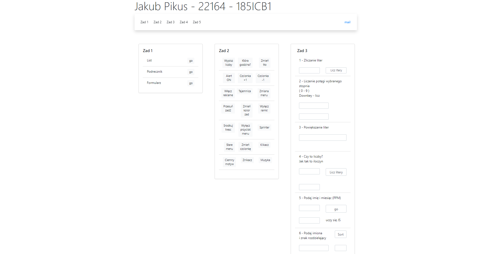
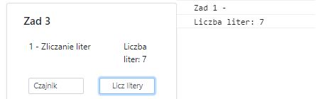
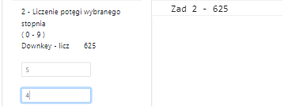
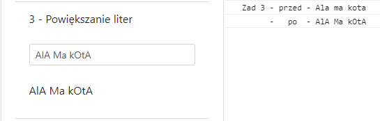
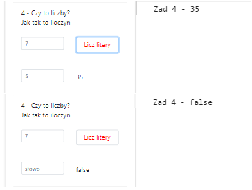
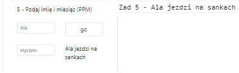
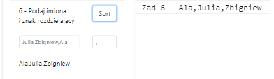
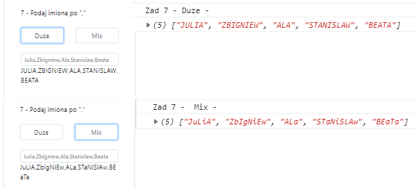
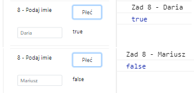
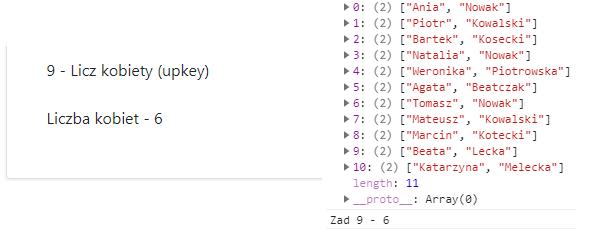

# Lab3

<h3>Jakub Pikus</h3>
<h3>185IC_B1</h3>
<h3>22164</h3>

# index.html

Plik index.html został uzupełniony o dodatkową kartę z zadaniami

Wszystkie zadania wywoływane są przez EventListener

# Zadania

<h3>Zad 1.</h3>

Napisz funkcję, która przyjmie jeden parametr - dowolny tekst.   Funkcja niech ZWRACA tekst Liczba liter: .... gdzie .... to liczba liter tekstu. Wynik jej użycia wypisz w konsoli za pomocą console.info()

 

function zwracanie(n) {

	var answer = "Liczba liter: " + n.value.length;
	console.log("Zad 1 - ");
	console.log(answer);
	return answer;
}

 

 

EventListener - click

  

<h3>Zad 2.</h3>

Napisz funkcje, która zsumuje przekazaną do niej tablicę i zwraca jej sumę. Stwórz dowolną tablicę, a następnie przekaż ją do tej funkcji i wynik wypisz w konsoli.

 

function zwracanie(n) {

	var answer = "Liczba liter: " + n.value.length;
	console.log("Zad 1 - ");
	console.log(answer);
	return answer;
}

 

 

EventListener - click

  

<h3>Zad 3.</h3>

Napisz funkcję, która przyjmie dowolny tekst. Funkcja niech zwraca tekst, który ma zmiksowana wielkość liter np: 

input -> Ala ma kota 
output -> AlA Ma kOtA 
Dla ułatwienia spacje liczmy jako literę.

 

function zwracanie(n) {

	var answer = "Liczba liter: " + n.value.length;
	console.log("Zad 1 - ");
	console.log(answer);
	return answer;
}

 

 

EventListener - click

  

<h3>Zad 4.</h3>

Napisz funkcje, która będzie wymagać 2 atrybutów. Funkcja niech sprawdza, czy oba atrybuty są liczbami. Funkcja ma zwracać iloczyn (*) obu liczb. Jeżeli któryś z atrybutów nie jest liczba, funkcja niech zwraca false.

 

function zwracanie(n) {

	var answer = "Liczba liter: " + n.value.length;
	console.log("Zad 1 - ");
	console.log(answer);
	return answer;
}

 

 

EventListener - click

  

<h3>Zad 5.</h3>

Napisz funkcje, która przyjmuje 2 parametry: 

imię - np: Ala 
miesiac - np: styczen 
Funkcja ma zwracac: 

jezeli miesiac to grudzien, styczen, luty: "Ala jezdzi na sankach" 
jezeli miesiac to marzec, kwiecien, maj: "Ala chodzi po kaluzach" <
jezeli miesiac to czerwiec, lipiec, sierpien: "Ala sie opala" 
jezeli miesiac to wrzesien, pazdziernik, listopad: "Ala zbiera liscie" 
Wywołaj funkcje przekazując do niej zmienne: twoje imię i dowolny miesiąc. 

Dopisz w funkcji zabezpieczenie, które pozwoli wpisać miesiac małymi lub dużymi literami. Jeżeli miesiac jest "innym słowem", funkcja niech zwraca "Ala uczy się JS"

 

function zwracanie(n) {

	var answer = "Liczba liter: " + n.value.length;
	console.log("Zad 1 - ");
	console.log(answer);
	return answer;
}

 

 

EventListener - click

  

<h3>Zad 6.</h3>

 

function zwracanie(n) {

	var answer = "Liczba liter: " + n.value.length;
	console.log("Zad 1 - ");
	console.log(answer);
	return answer;
}

 

 

EventListener - click

  

<h3>Zad 7.</h3>

 

function zwracanie(n) {

	var answer = "Liczba liter: " + n.value.length;
	console.log("Zad 1 - ");
	console.log(answer);
	return answer;
}

 

 

EventListener - click

  

<h3>Zad 8.</h3>

 

function zwracanie(n) {

	var answer = "Liczba liter: " + n.value.length;
	console.log("Zad 1 - ");
	console.log(answer);
	return answer;
}

 

 

EventListener - click

  

<h3>Zad 9.</h3>

 

function zwracanie(n) {

	var answer = "Liczba liter: " + n.value.length;
	console.log("Zad 1 - ");
	console.log(answer);
	return answer;
}

 

 

EventListener - click

  

XDDDDDDDDDDDDDDDDDDDDDDDDDDDDDDDDDDDDDDDDDDDDDDDDDDDDDDDDDDDDDDDDDDDDDDDDDDDDDDDDDDDDDDDDDDDDDDDDDDDDDDDDDDDDDDDDDDDDDDDDDDDDDDDDDDDDDDDDDDDDDDDDDDDDDDDDDDDDDDDDDDDDDDDD
Zad 2.

Napisz funkcje, która zsumuje przekazaną do niej tablicę i zwraca jej sumę. 

Stwórz dowolną tablicę, a następnie przekaż ją do tej funkcji i wynik wypisz w konsoli.

function sumowanieTablicy(tablica) {

	var suma = 0;

	for(i = 0; i < tablica.length; i++){
		suma = suma + Number(tablica[i]);
	}
	console.log("Zad 2 - " + suma);
	return suma;
}

Zad 3.

Napisz funkcję, która przyjmie dowolny tekst. Funkcja niech zwraca tekst, który ma zmiksowana wielkość liter np: output -> AlA Ma kOtA     

Dla ułatwienia spacje liczmy jako literę. -->

function duzeLitery(w){
	
	var zdanieTablica = w.split('',w.length);
	var gotowe= "";
	for(i = 0; i < w.length;i++){

	  if(i % 2 == 0){
		zdanieTablica[i] = zdanieTablica[i].toUpperCase();
	  }
	  gotowe += zdanieTablica[i];
	}
	
	return gotowe;
}

//<!-- Zad 4 -->
//<!-- Napisz funkcje, która będzie wymagać 2 atrybutów. Funkcja niech sprawdza, czy oba atrybuty są liczbami. 

//Funkcja ma zwracać iloczyn (*) obu liczb. Jeżeli któryś z atrybutów nie jest liczba, funkcja niech zwraca false. -->    

function mnozenie(a,b){

	var wartosc1 = parseInt(a);
	var wartosc2 = parseInt(b);

	if(isNaN(wartosc1) || isNaN(wartosc2) ){
		return false;
	}
	else return wartosc1*wartosc2;
}

//<!-- Zad 5 -->
//<!-- Napisz funkcje, która przyjmuje 2 parametry:

//- imię - np: Ala
//- miesiac - np: styczen

//- Funkcja ma zwracac:

//- jezeli miesiac to grudzien, styczen, luty: "Ala jezdzi na sankach"
//- jezeli miesiac to marzec, kwiecien, maj: "Ala chodzi po kaluzach"
//- jezeli miesiac to czerwiec, lipiec, sierpien: "Ala sie opala"
//- jezeli miesiac to wrzesien, pazdziernik, listopad: "Ala zbiera liscie"
//- Wywołaj funkcje przekazując do niej zmienne: twoje imię i dowolny miesiąc.

//Dopisz w funkcji zabezpieczenie, które pozwoli wpisać miesiac małymi lub dużymi literami. Jeżeli miesiac jest "innym słowem", funkcja niech zwraca "Ala uczy się JS" -->   

function coRobisz(a,b){

	if(b =='grudzien' || b =='styczen' ||b =='luty'){
		return a + " jezdzi na sankach";
	}

	else if(b =='marzec' || b =='kwiecien' ||b =='maj'){
		return a + " chodzi po kaluzach";
	}

	else if(b =='czerwiec' || b =='lipiec' ||b =='sierpien'){
		return a + " sie opala";
	}

	else if(b =='wrzesien' || b =='pazdziernik' ||b =='listopad'){
		return a + " zbiera liscie";
	}

	else {
		return a + " uczy się JS";
	}
}

//<!-- Zad 6 -->
//<!-- Mamy przykładowy tekst:

//const str = "Ania|Marcin|Bartek|Piotr|Kuba|Beata|Agnieszka";
//Napisz funkcję, która przyjmie 2 atrybuty:

//tekst
//znak rozdziału (np. |)
//Skorzystaj z odpowiedniej metody, tak aby rozdzielić przekazany do funkcji tekst na części za pomocą przekazanego znaku rozdziału. W wyniku rozdzielenia powinieneś dostać tablicę. Funkcja niech posegreguje tą tablicę alfabetycznie. Następnie funkcja niech połączy tą tablicę w nowy tekst wstawiając między imiona znak wcześniejszego rozdziału. Skorzystaj tutaj z innej odpowiedniej metody js.

//input -> "Ania|Marcin|Bartek" output -> "Ania|Bartek|Marcin"

//Wywołaj tę funkcję przekazując do niej str z początku zadania  --> 

function sortowanie(a,b){

	const tab = a.split(b);
	var tablicaNowa = tab.sort();
	return tablicaNowa.join([separator = b])

}

//<!-- Zad 7 -->
//<!-- Napisz 2 funkcje. Każda z nich niech przyjmuje tablicę imion.

//Pierwsza funkcja niech zwraca nową tablicę, w której imiona są zapisane dużymi literami. Druga funkcja niech zwraca nową tablicę, w której imiona mają zmienną wielkość liter.

//input -> ["Ania" , "Marcin" , "Bartek" , "Piotr"]
//output1 -> ["ANIA" , "MARCIN" , "BARTEK" , "PIOTR"]
//output2 -> ["AnIa" , "MaRcIn" , "BaRtEk" , "PiOtR"]  --> 

function podniesLitery(tekst){
	
	var duzaTablica = tekst.map(imie => imie.toUpperCase());
	return duzaTablica;
}

function mieszajLitery(tab){

	
	var ciagElementow = tab.join();
	var ciagLiter = [...ciagElementow];
	ciagZmieniony = '';

	for(i = 0; i < ciagLiter.length;i++){

	  if(i % 2 == 0){
		ciagLiter[i] = ciagLiter[i].toUpperCase();
	  }
	  ciagZmieniony += ciagLiter[i];
	}
	var wymieszanaTablica = ciagZmieniony.split(',');

	
	return wymieszanaTablica
	
}

//<!-- Zad 8 -->
//<!-- Napisz funkcję checkFemale, która sprawdza przekazane do niej imię. 

//Zróbmy proste teoretyczne założenie, że jeżeli imię kończy się literą "a" to jest to żeńskie imię, w przeciwnym wypadku męskie. 
//Funkcja powinna wracać true jeżeli imię jest żeńskie i false jeżeli jest męskie. Przykładowo:

//checkFemale("Ania") === true
//checkFemale("Marcin") === false    -->

function checkFemale(n){

	var ciagLiter = [...n];
	if(ciagLiter[ciagLiter.length - 1] == "a"){
		return true
	}
	else{
		return false
	}
}

//<!-- Zad 9 -->
//<!-- Napisz funkcję countWomanInTable(arr), do której przekażesz tablicę userów, którą masz poniżej. 
//Funkcja powinna sprawdzić każdego użytkownika w tablicy i zwrócić ile jest kobiet. Wykorzystaj tutaj funkcję z poprzedniego zadania. 
//Jak pobrać imię z usera? Możesz to osiągnąć za pomocą metody split(). Podziel string na 2 części - uzyskasz tablicę 2 elementów. Pierwszy to imię, drugi to nazwisko -->

function countWomanInTable(arr){

	var licz = 0;

	for(i = 0; i < arr.length;i ++ ){
		arr[i] = arr[i].split(" ");
		if( checkFemale(arr[i][0]) ){
			licz = licz + 1;

		}
	}

		console.log("Zad 9 - " + licz);
		return licz
}

