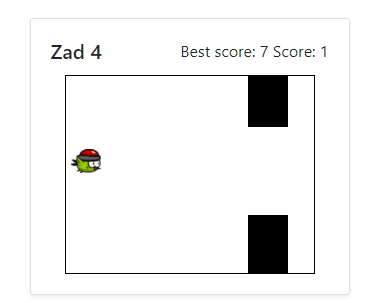

# Lab4

<h3>Jakub Pikus</h3>
<h3>185IC_B1</h3>
<h3>22164</h3>

# Flappy Bird

Plik index.html został uzupełniony o dodatkową kartę z grą

Gra polega na przelatywaniu ptaszka przez luki 

Funkcje zostały dokładnie opisane w skrypcie

# Działanie gry

Przeszkoda to 2 divy, 1 generujący się regularnie po całej wysokości ramki, drugi jest narzucony na niego w kolorze białym.
Animacja ich jest zapisana w pliku style.css. Generowanie kolejnych luk polega na wylosowaniu liczby w dziedzinie <90;201> (minimalna wartość
to wysokość luki, ponieważ punkt odniesienia leży w górnej jej krawędzi; najwieksza wartosc to górna granica ramki).

  
  

 Skaczemy lewym przyciskiem myszy, wtedy wartość "skacz" zmienia się z 0 na 1 (potrzebne do grawitacji), a sam model zostanie przesunięty
do góry. Jeżeli skok nie jest aktywny, model spada o 1 piksel do dołu co 10 ms.

 Kolizje możemy podzielić na 2 kategorie: 
1 - jeśli model dotyka górnej/dolnej krawędzi ramki gry -    "(wysokosc>229||wysokosc<55)" 
  lub 
2 - (szerokość przeszkody) * górna przeszkoda    lub    (szerokość przeszkody) * dolna przeszkoda
  

