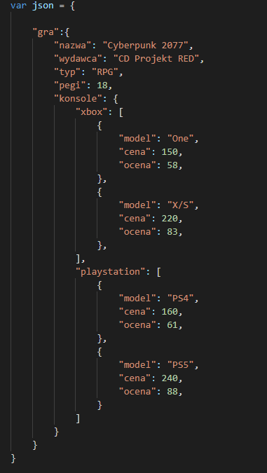
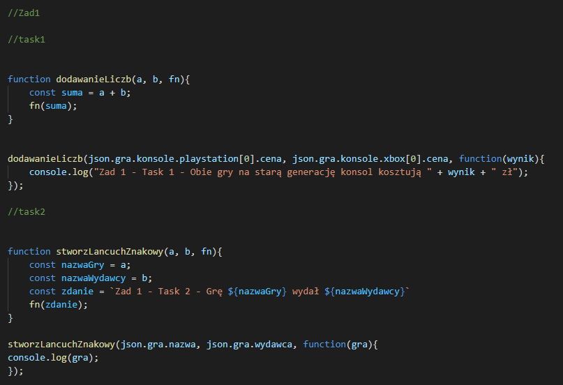
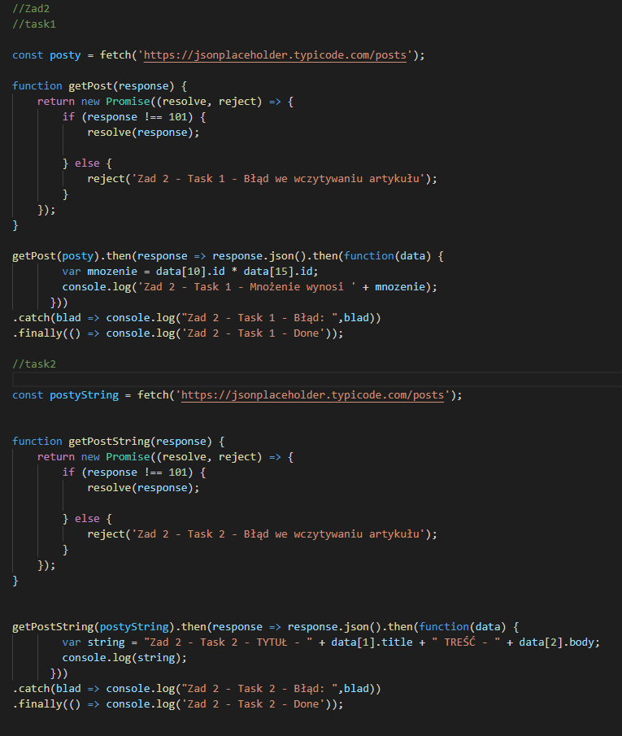
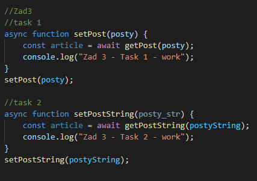
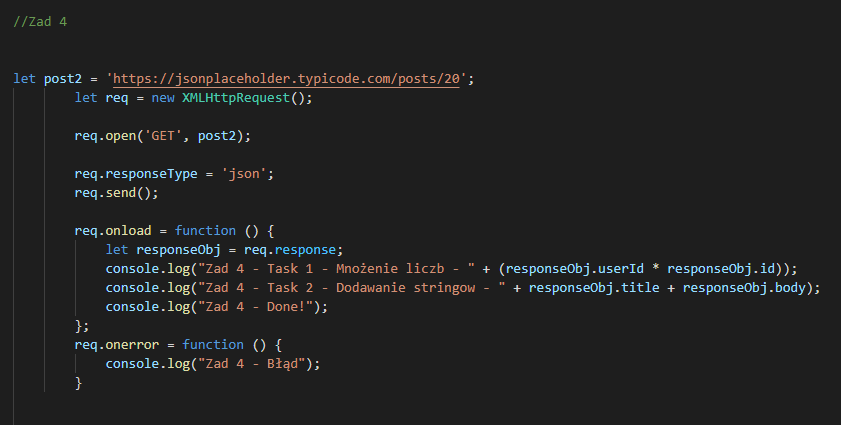
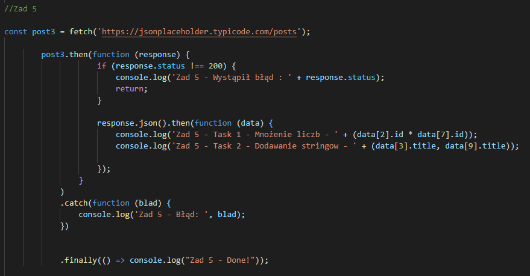
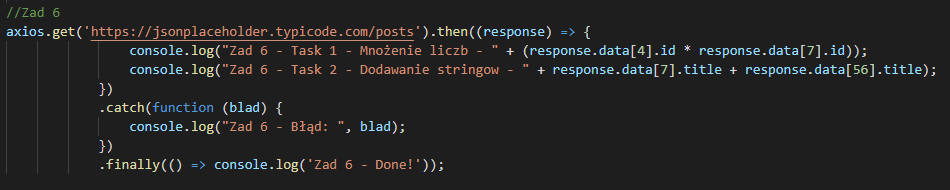
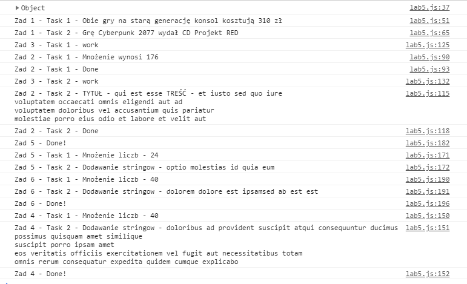

# Lab5

<h3>Jakub Pikus</h3>
<h3>185IC_B1</h3>
<h3>22164</h3>

# Klasa JSON

# Zadania

<h3>Zad 1.</h3>

funkcja zwrotna (callback)
 

task1: wykorzystaj funkcję zwrotną do pobrania dwóch różnych wartości liczbowych (z różnych poziomów zagnieżdżenia) z ww. obiektu JSON i wykonaj wybrane działanie na tych liczbach
 

task 2: wykorzystaj funkcję zwrotną do pobrania dwóch różnych łańcuchów znakowych (z różnych poziomów zagnieżdżenia) z ww. obiektu JSON i za pomocą template strings stwórz łańcuch znakowy z użyciem obu wcześniej wyekstrahowanych łańcuchów znakowych.
 

<h3>Zad 2.</h3>

<h3>Zad 3.</h3>

<h3>Zad 4.</h3>

<h3>Zad 5.</h3>

<h3>Zad 6.</h3>

# Wyniki

