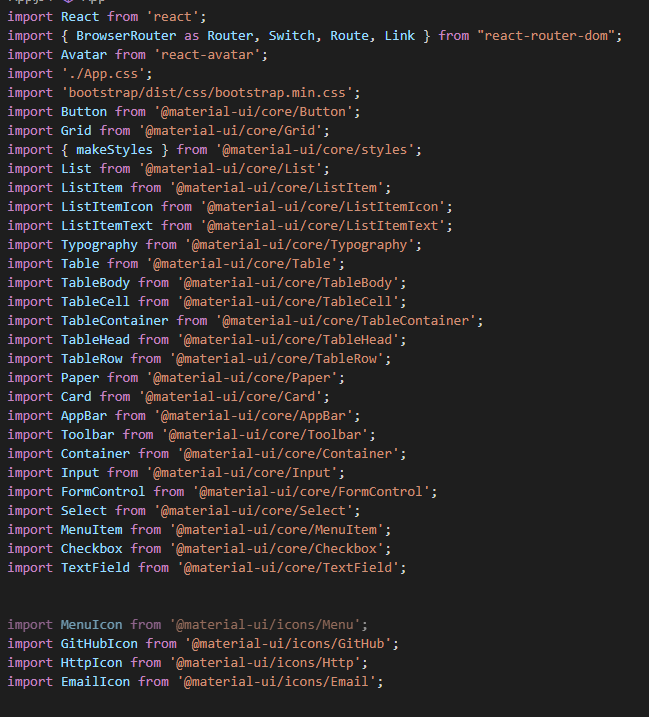
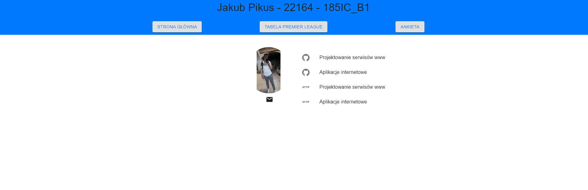
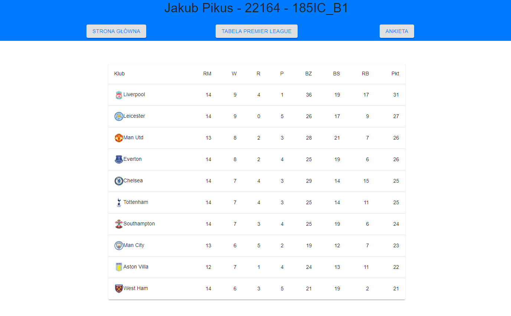

# Lab7

<h3>Jakub Pikus</h3>
<h3>185IC_B1</h3>
<h3>22164</h3>

# Wszystkie użyte komponenty na 3 podstronach

# Podstrony

<h3>Strona główna</h3>

<h3>Tabela Premier League</h3>

<h3>Ankieta</h3>

