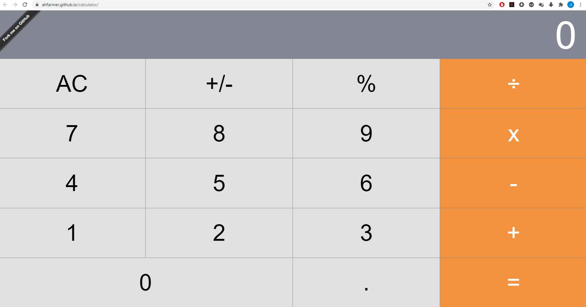

# Lab8

<h3>Jakub Pikus</h3>
<h3>185IC_B1</h3>
<h3>22164</h3>

# Kalkulator 

<h3>Przed zmianą</h3>

[ahfarmer.github.io/calculator](https://ahfarmer.github.io/calculator/)

<h3>Po zmianie</h3>

Kalkulator został wzbogacony o liczenie potęgi dowolnego wykładnika, dodatniego jak i ujemnego

Opis został zamieszczony do App.js

# Git Diff

Aplikacja została odpowiednio spushowana przed zmianą i po, aby można było porównać zmiany w kodzie.   Niżej zamieszczam wszystkie zmiany, w kolejności chronologicznej

