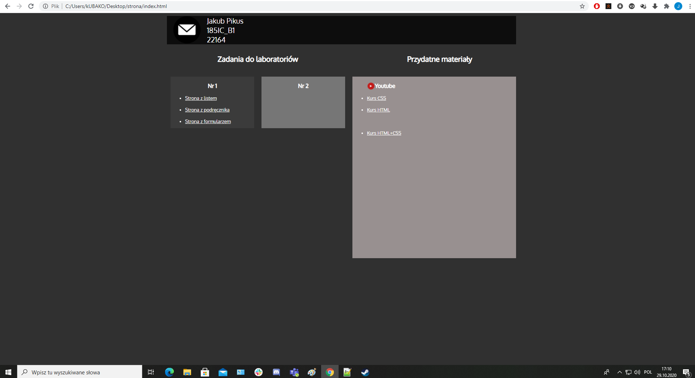
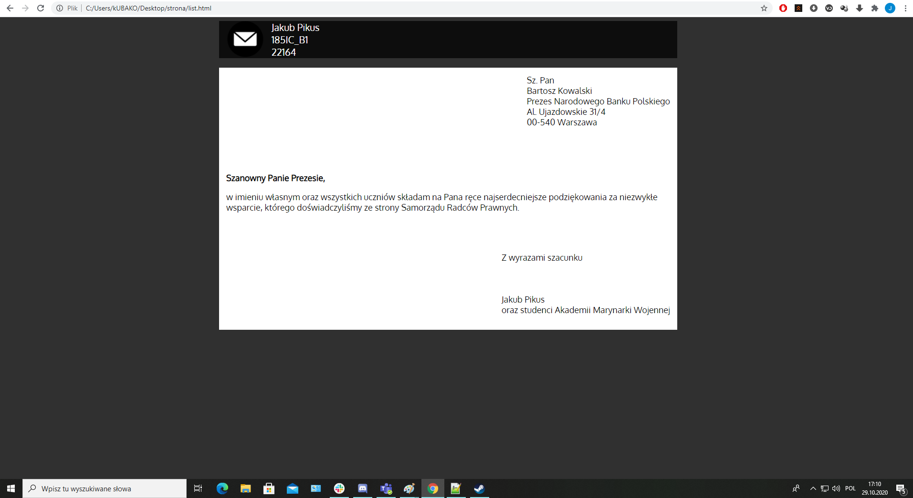
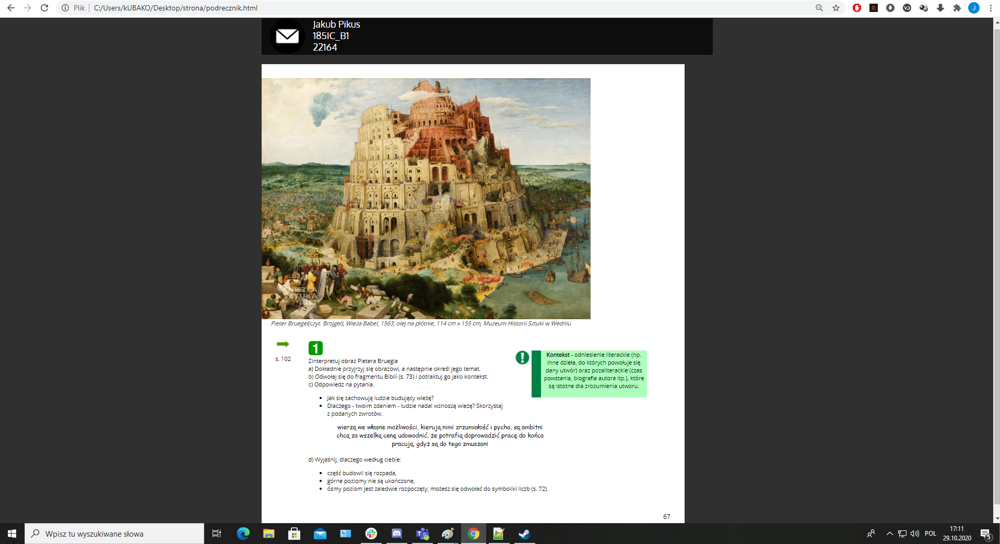
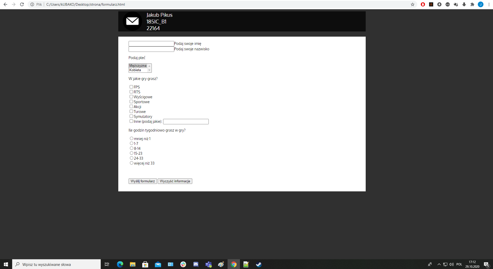

# projektowanie-serwisow-www-22164-185ic

<h3>Jakub Pikus</h3>
<h3>185IC_B1</h3>
<h3>22164</h3>

Plik index.html zawiera stronę główną z odnośnikami do przekierowania na konkretną podstronę 
używa on pliku style.css, do poprawnego wyświetlania wszystkich obiektów

Plik list.html to podstrona z listem 
używa on list.css, do poprawnego wyświetlania wszystkich obiektów

Plik podrecznik.html to podstrona z podręcznikiem 
używa on pliku podrecznik.css

Plik formularz.html to podstrona z formularzem 
używa on pliku podrecznik.css

Wszystkie zdjęcia, które pojawiają się na stronie znajdują się w folderze "img" 
zdjęcia użyte do zaprezentowania działania strony znajdują się w folderze "zrzuty"

# index.html

# list.html

# podrecznik.html

# formularz.html

